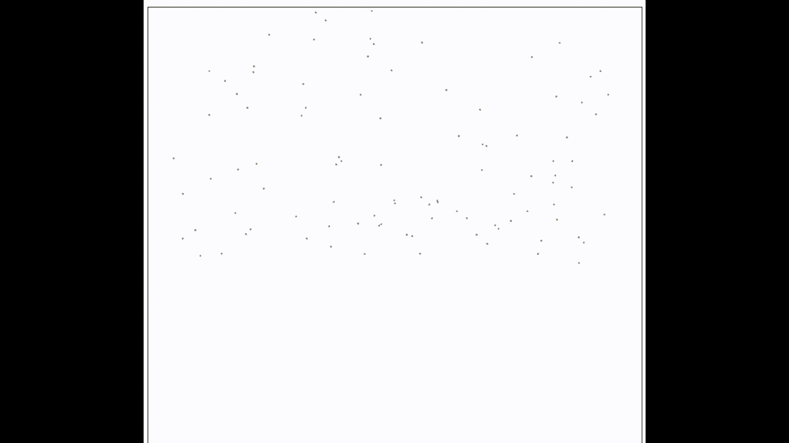
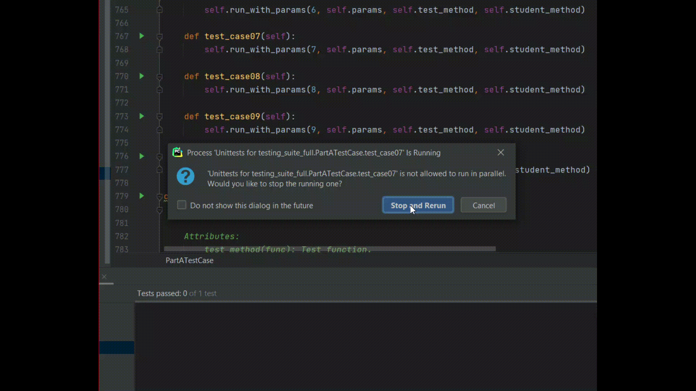
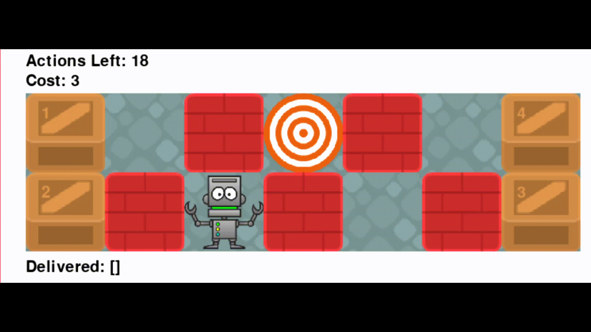
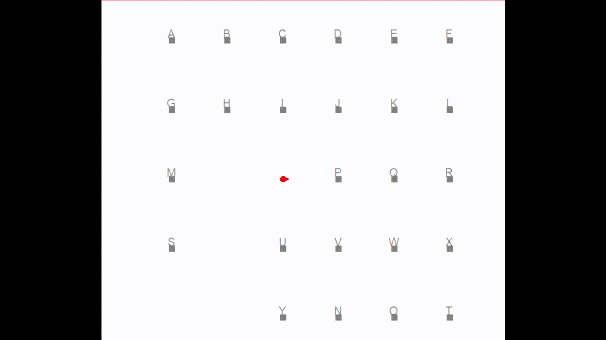

# AI4RDemo

(Project display only, source code are saved in a private repository)

Project 1 - Kalman Filter to locate meteorites and defend against the meteorite shower

Project 2 - Particle Filter to track and navigate a glider to safely land on mars

Project 3 - Use A* and Dynamic Programming to navigate robot with optimal moves to pick and delivery boxes

Project 4 - Online SLAM to map the unknown gem locations and navigate the robot to collect the gems in a required order

